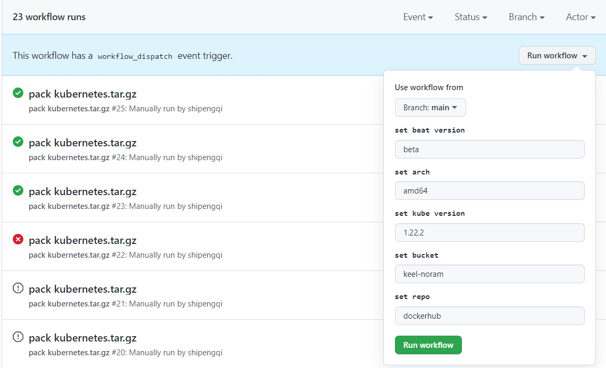

# keel-pkg
keel tools for syncing images from **k8s.gcr.io** and packing kubernetes.tar.gz.


## Usage
```bash
$ ./packer -h
Pack kubernetes.tar.gz

Usage:
  packer [options]

Flags:
  -u, --username string            The username of the registry to be pushed
  -p, --password string            The password of the registry to be pushed
      --command-timeout duration   Set timeout for the command execution
      --version-config string      The location of versions config file (default "versions.json")
  -o, --image-output string        The location of images output (default "/var/run/keel/pack/images")
  -h, --help                       help for packer
  -v, --version                    version for packer


$ ./synctl sync -h
Sync images

Usage:
  synctl sync [options]

Flags:
  -u, --username string            The username of the registry to be pushed
  -p, --password string            The password of the registry to be pushed
      --push-to string             The registry to be pushed (default "registry.cn-hangzhou.aliyuncs.com")
      --push-ns string             The namespace of the registry to be pushed (default "keel")
      --db string                  The location of boltdb file (default "sync.bolt.db")
      --query-limit int            Set http query limit (default 10)
      --limit int                  Set sync limit (default 5)
      --command-timeout duration   Set timeout for the command execution
      --push-timeout duration      Set timeout for pushing a image (default 15m0s)
      --retry int                  Retry count. (default 5)
      --retry-interval duration    Retry interval (default 5s)
      --addition-ns strings        Additional namespaces to sync
      --image-set string           The location of image-set file (default "image_set.json")
  -h, --help                       help for sync
```

## Example
sync images:
```bash
$ ./synctl sync \
--db ${HOME}/sync.bolt.db \
-u ${ REGISTRY_USER } \
-p ${ REGISTRY_PASS } \
--push-ns=${ REGISTRY_NAMESPACE }  \
--command-timeout ${TIMEOUT:=2h}  \
--limit ${LIMIT:=8}
```

## How to build
```bash
make              - help
make build        - build synctl and packer
     version        the version of commands, default is 'v1.0.0'. e.g. 'make build version=v1.1.2'
make build-sync   - build synctl
     version        the version of synctl command, default is 'v1.0.0'. e.g. 'make build-sync version=v1.1.2'
make build-pack   - build packer
     version        the version of packer command, default is 'v1.0.0'. e.g. 'make build-pack version=v1.1.2'
make clean        - remove binary file and prune image
```

`versions.json` version of components for packing:
```json
{
  "arch": "amd64",
  "images": [
    {"name":  "etcd", "tag": "3.4.7"},
    {"name":  "flannel", "tag": "0.5.5"},
    {"name":  "kube-proxy", "tag": "v1.22.2"},
    {"name":  "kube-apiserver", "tag": "v1.22.2"},
    {"name":  "kube-controller-manager", "tag": "v1.22.2"},
    {"name":  "kube-scheduler", "tag": "v1.22.2"},
    {"name":  "coredns", "tag": "1.7.0"},
    {"name":  "metrics-server", "tag": "v0.3.6"}
  ],
  "components": [
    {"name":  "containerd", "tag": "1.5.7"},
    {"name":  "runc", "tag": "1.0.2"},
    {"name":  "crictl", "tag": "1.22.0"},
    {"name":  "kubectl", "tag": "1.22.2"},
    {"name":  "kubelet", "tag": "1.22.2"}
  ]
}
```

`image_set.json` image list for syncing:
```json
{
  "names": [
    "etcd",
    "etcd-amd64",
    "etcd-arm",
    "etcd-arm64",
    "etcd-ppc64le",
    "etcd-s390x",
    "coredns",
    "nginx"
  ],
  "prefixes": [
    "kube",
    "k8s",
    "flannel",
    "fluentd",
    "fluent-bit",
    "hyperkube",
    "metrics-server",
    "pause",
    "alpine-iptables",
    "debian-iptables",
    "federation",
    "nginx-ingress"
  ],
  "exclude": [
    "-beta",
    "-alpha"
  ]
}
```

- `names` contains a list of images that need to be synchronized.
- `prefixes` contains a list of name prefixes of images that need to be synchronized.
- `exclude` if the image name contains these strings then it will not be synchronized.
- `patches`

### pack workflow


- `set beat version`, will add a beta suffix to the package name. e.g. kube-1.22.2-amd64-beta.tar.gz.
- `set arch`, will set the arch of the package name.
- `set kube version`, set kubernetes version of the package name.
- `set bucket`, set the storage bucket of qiniu cloud.
- `set repo`, if the value is not "dockerhub", will push the package to the qiniu cloud.

## Registry
- [Google GCR](https://console.cloud.google.com/gcr/images/google-containers)
- [AliCloud ACR](https://cr.console.aliyun.com/cn-hangzhou/instances/images)
  - [ACR doc](https://help.aliyun.com/document_detail/257112.html?spm=5176.166170.J_5253785160.5.286851646Ug5KU)
- [Huawei Swr](https://console-intl.huaweicloud.com/swr/?agencyId=1e02890d062a42f9be14b82feaa5b711&region=cn-east-3&locale=zh-cn#/app/swr/huaweiOfficialList)
  - [Swr doc](https://support.huaweicloud.com/intl/zh-cn/productdesc-swr/swr_03_0001.html)
- [quay.io](https://quay.io/organization/coreos)
  - [flannel](https://quay.io/repository/coreos/flannel?tab=tags)

## Reference
- https://github.com/containerd/containerd
- https://github.com/containerd/containerd/blob/main/docs/RUNC.md
- https://github.com/opencontainers/runc
- https://github.com/kubernetes-sigs/cri-tools/blob/master/docs/crictl.md
- https://kubernetes.io/releases/download/
- https://blog.csdn.net/networken/article/details/84571373
- https://github.com/actions/upload-artifact/issues/8
- https://github.com/actions/upload-artifact/tree/v2-preview#environment-variables-and-tilde-expansion
- https://hub.docker.com/r/flannelcni/flannel-cni-plugin
- https://github.com/flannel-io/flannel/issues/784
